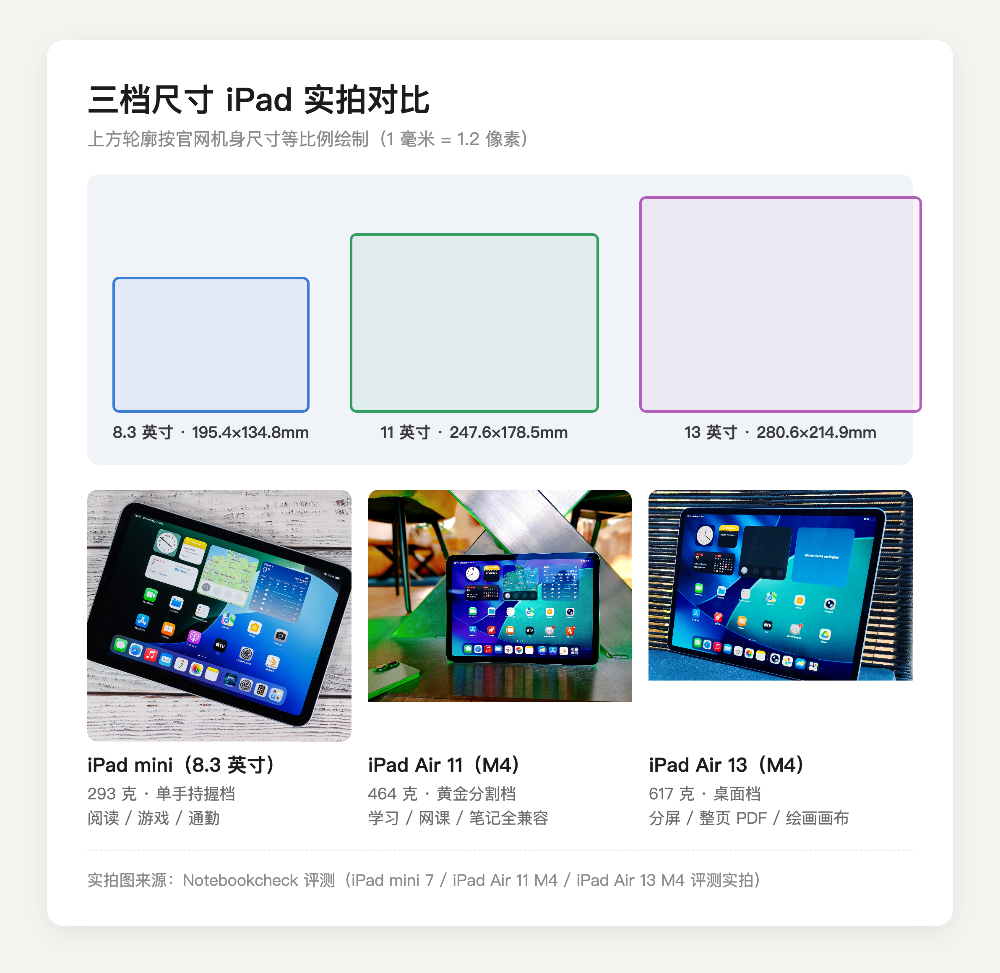
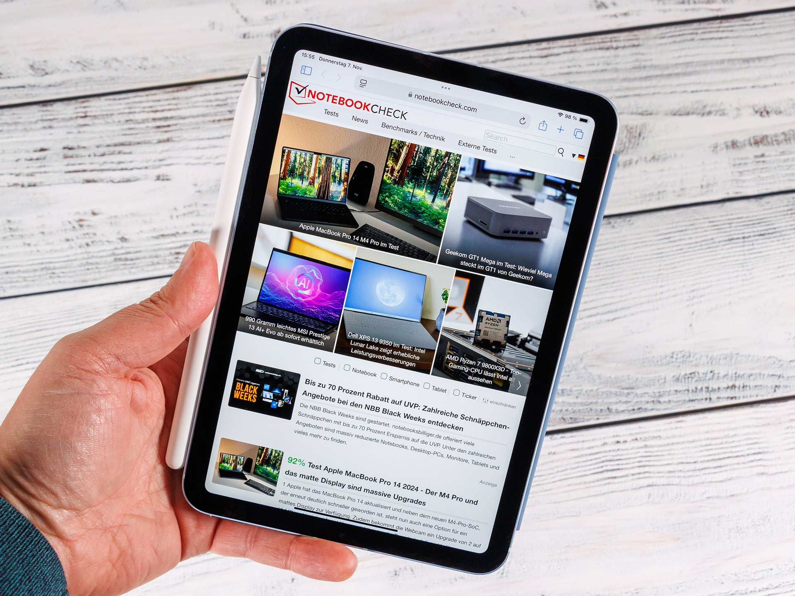
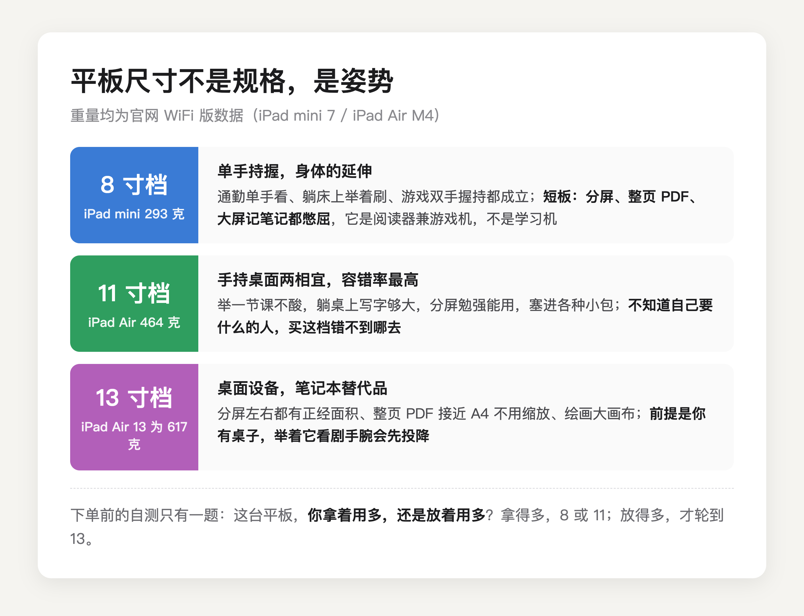

这道题你会纠结，是因为用错了度量衡。**平板的尺寸不是规格参数，是姿势参数**，它决定的不是屏幕有多大，是你的手每天要承担多少重量。结论先说：拿着用多，买 8 到 11 寸；放着用多，才轮得到 13 寸。

把重量摆出来就明白了。苹果官网规格页：iPad mini 293 克，11 英寸 iPad Air 464 克，13 英寸 iPad Air 617 克。从 8 寸档到 13 寸档，屏幕面积翻了倍，重量也翻了倍。尺寸每涨一档，你买到的不只是显示面积，还有一份天天要举着的分量。

（轮廓按苹果官网机身尺寸等比例绘制，实拍图来源：Notebookcheck 评测）

所以正确的问法不是「买多大」，是先问自己一句，这台平板，我拿着用多，还是放着用多？

先说 8 寸档（8.3 到 8.8 英寸），单手持握档，代表机型 iPad mini。293 克，跟一部戴了壳的大屏手机差不多分量。这是唯一能让你长时间单手拿稳的平板尺寸，地铁上单手看文档、躺床上举着刷半小时、打游戏双手握持拇指够得到全屏，都成立。代价也明明白白，分屏别想，整页 PDF 字小一圈，记笔记摊不开。它的身份是阅读器兼游戏机，不是学习机。

（图源：Notebookcheck 评测实拍）

11 寸档，黄金分割档。464 克，举着上完一节课手不酸，放桌上写字空间够，分屏勉强能用，双肩包帆布包都塞得进。它的策略是什么都能干一点，什么都不做到极致。苹果自己也把主力铺在这档，入门 iPad 和 iPad Air 都是 11 寸上下。**不知道自己要什么的人，买这档错不到哪去。**

（图源：Notebookcheck 评测实拍）

13 寸档，桌面档。617 克，戴壳贴膜奔着 800 克去，接近一瓶半矿泉水，举着追剧手腕会先投降。但只要把它放上桌子，这多出来的分量立刻不算事，大屏的好处开始逐条兑现：分屏左边视频右边笔记互不将就，整页 PDF 接近 A4 纸的实际大小不用缩放，绘画画布摊得开。顺带纠正一个担心，大屏不会更清晰也不会更糊，11 寸和 13 寸的 iPad Air 在苹果官网规格页上都是 264 ppi，同样的字一样锐利，大的只是面积。这档的正确打开方式是配支架或键盘，当半个笔记本用。

姿势之外，还有几个角度值得过一遍，每条都能直接否掉一档。

预算。同配置从 11 寸升到 13 寸，iPad Air 要加 1700 块（官网 5999 对 7699）。这 1700 买到的是面积、亮度和扬声器，不是性能，两台机器芯片一模一样。预算卡得紧，这道算术题先做。

包。13 寸机身宽 21.5 厘米，很多帆布包和小双肩的主仓刚好卡不进去。每天背包通勤的人，买之前拿尺子量一下常背的那个包，比看评测有用。

游戏。双手握持打游戏的，11 寸是上限，拇指刚好够到屏幕中央；13 寸端在手里像端托盘，技能键按不利索，重一点的游戏举半小时手腕就酸。

给谁买。给长辈买，大屏大字体是刚需，13 寸的优先级往前排；给小孩上网课，11 寸足够，还小还轻还便宜，摔了也没那么心疼。

续航别拿来当理由。13 寸 iPad Air 电池 36.59 瓦时，比 11 寸的 28.93 瓦时大 27%，但大屏本身是耗电大户，Notebookcheck 实测 WiFi 上网续航，13 小时 23 分对 11 小时 59 分，只多出 12%。**大出来的电池，大半喂给了大出来的屏幕**，为续航加钱上大屏，不划算。

最后给个干脆的决策。拿着用多，手小或者纯娱乐选 8 寸档，要兼顾学习办公选 11 寸档。放着用多，分屏、啃文献、绘画有明确桌面场景的，选 13 寸档，下单前先确认你真的有那张桌子。还有犹豫的，一律 11 寸档，它是这道题里容错率最高的答案。

尺寸选对的幸福，是你从此感觉不到尺寸的存在；选错的代价，是每天举起它的那一下都在提醒你。

---

各尺寸 iPad 的具体价格、教育优惠怎么认证、国补怎么叠，我在这篇里逐台算过，9 月 24 日截止前都管用：

[2026 苹果返校季教育优惠全攻略：官网 vs 京东国补逐台实算](https://zhuanlan.zhihu.com/p/156150196)

---

【延迟插卡：发布 48h 后若排名进前 5 或赞数 ≥ 能力先验下沿（5 赞），编辑插入——商品：iPad Air 11 英寸 M4（京东自营教育优惠版，链接待从京东好物库检索补齐），位置建议：11 寸档段落「错不到哪去」之后】
