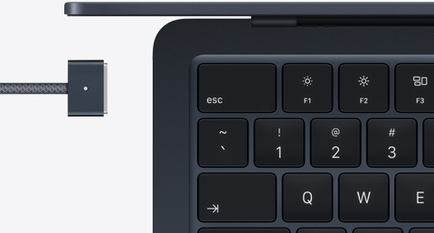
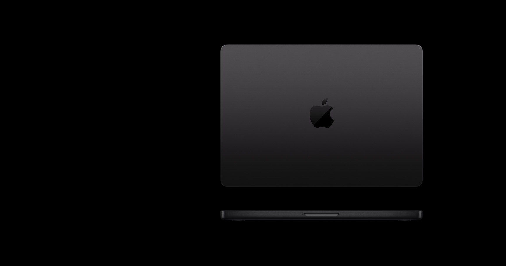

第一次买 Mac，问「性价比最高」，这个问题本身就值得先拆一下。

**性价比不是「最便宜」，是「你花的每一块钱，有多少真正用到了」。** 一台 4799 的机器你只用了它 30% 的能力，性价比不如一台 9249 的机器你用到了 90%。

所以我的回答分两步：先帮你搞清楚你是哪种人，再告诉你哪种机器对你性价比最高。

---

## 先对号入座

**第一种：预算卡死在 5000 以内，就想进苹果生态。**

你的选择只有一个：**MacBook Neo。**

官网 5499 起，教育价 4799 起。铝合金机身，A18 Pro 芯片（就是 iPhone 16 Pro 里那颗），13 英寸 Liquid 视网膜屏，无风扇静音设计。[Notebookcheck 实测](https://www.notebookcheck-cn.com/Apple-MacBook-Neo-599.1250334.0.html)日常任务飞快，WiFi 续航接近 13 小时。

但你要接受三个妥协：8GB 内存（后期加不了）、无键盘背光、一个 USB-C 口是 USB 2.0 速度。

**适合谁：** 文档、网课、网页、邮件、轻度剪辑。不跑大型软件，不剪 4K，不本地跑模型。

**不适合谁：** 需要同时开几十个 Chrome 标签页的人、晚上在宿舍用电脑的人、对续航有硬性要求的人。

_图源：Notebookcheck 评测实拍_

**Neo 不是「性价比最高的 Mac」，是「唯一能买得起的 Mac」。** 这句话我在新品评测里说过，今天还是这个结论。

---

## 第二种：预算 8000-10000，想要一台正经的主力机

这个价位段，**MacBook Air 13 英寸 M5，16GB+512GB，性价比最高。**

为什么？因为这是苹果产品线里「每一分钱都花在刀刃上」的机器。

官网教育价 9249，京东自营叠 15% 国补到手 7861——这个价是我 2026 年 8 月亲手查的。7861 块你买到：M5 芯片（性能过剩到离谱）、16GB 内存（2026 年的底线）、512GB 存储、铝合金机身、MagSafe 充电、Touch ID、键盘背光、两个雷雳口。

[Notebookcheck 实测](https://www.notebookcheck-cn.com/Apple-MacBook-Air-13-M5.1244739.0.html) WiFi 续航 16 小时往上，带去图书馆一整天不用带充电器。重量 1.23 公斤，塞进任何背包都不占地方。

**这台机器的性价比逻辑是：** 它覆盖了 90% 大学生的全部使用场景——写论文、看课件、做 PPT、查资料、看视频、轻度修图、写代码。剩下的 10%（剪 4K、跑大模型、编译大型项目），Air 干不了，但 90% 的人根本用不到那 10%。

_图源：苹果官网_

**如果预算能到 9000-9500（国补前），加 1500 上 24GB 内存。** 这是整台机器生命周期里最值得加的一笔钱。芯片决定跑多快，内存决定能不能跑。打算用四年的话，24GB 摊到每年不到 400 块，比中途换机划算。

---

## 第三种：预算 12000+，专业需求明确

如果你是设计、摄影、影视、计算机（AI/ML 方向），直接上 **MacBook Pro 14 英寸 M4 或 M5。**

Pro 比 Air 多的四样东西：XDR 屏幕（1600 尼特峰值亮度，120Hz）、主动散热（持续高负载不降频）、SD 卡槽 + HDMI + 三个雷雳口、六扬声器。

**这四样对普通人是浪费，对专业人士是刚需。** 摄影师不用 SD 卡槽就得额外买转接头，影视不用 HDMI 就没法快速接监视器，调色不用 XDR 屏幕就看不到真实的 HDR 效果。

Pro 14 M4 基础款教育价 12999，国补后大概 11000 上下。如果预算够，M5 版本性能更强，但 M4 对绝大多数专业场景已经过剩。

_图源：苹果官网_

---

## 一个反常识的结论

**性价比最高的 Mac，不是最便宜的那台，是你用得最充分的那台。**

4799 的 Neo 如果你只拿来写文档看网页，性价比很高。但如果你买回来发现 8GB 内存天天卡，开始后悔没加钱上 Air，那这台 Neo 的性价比就是零——因为你没在用它的 100%，你在忍受它的 30%。

反过来，9249 的 Air M5 如果你每天用 8 小时以上，写论文、做项目、剪视频、写代码全靠它，四年下来摊到每天不到 7 块钱。这个性价比，比任何 Windows 本都高。

**所以我的建议是：预算允许范围内，买你能买到的最好的 Mac。** 不是劝你多花钱，是苹果的机器真的能用很久。我见过太多人为了省 2000 块买了低配，两年后因为内存不够又买了一台——两次花的钱够直接买高配了。

---

## 购买渠道怎么选

最后说一嘴在哪买。

**苹果官网教育商店：** 价格透明，支持 24 期免息，返校季（通常 7-9 月）送 Apple Music 会员或配件抵扣。适合不着急、想等活动的人。

**京东自营教育优惠版：** 叠 15% 国补后通常比官网便宜 1000-1500。适合追求绝对低价的人。但要注意国补资格有时效，2026 年的政策 9 月 24 日截止。

**拼多多/抖音百亿补贴：** 价格可能更低，但要注意验货。收到机器先查序列号、查激活日期、跑一遍 Geekbench 确认配置。具体怎么验，我在这篇里写过清单：

[多口充电器选购指南：从协议到功率分配，一篇讲透](https://zhuanlan.zhihu.com/p/156150196)

---

## 一句话

**Neo 是门票，Air 是主力，Pro 是工具。**

你是哪种人，买哪种机器。别为用不到的能力买单，也别为省 2000 块买一台两年后后悔的机器。

_信源：苹果官网 MacBook 全系规格页及教育商店定价、京东自营国补实时价格（2026-08/09 采集）、Notebookcheck MacBook Neo/Air 13 M5 评测数据。_

---

更多关于 MacBook 选购和价格实算，可以看我的这篇：[2026 苹果返校季教育优惠全攻略：官网 vs 京东国补逐台实算](https://zhuanlan.zhihu.com/p/156150196)

【延迟插卡：本题为强购买意图决策题，但首发不带卡。发布 48h 后若排名进前 5 或赞数 ≥ 2，编辑插入——商品 1：MacBook Neo 教育价版（京东自营，链接待补齐），位置建议：「第一种」段之后；商品 2：MacBook Air 13 M5 16+512（京东自营教育优惠版），位置建议：「第二种」段之后】
