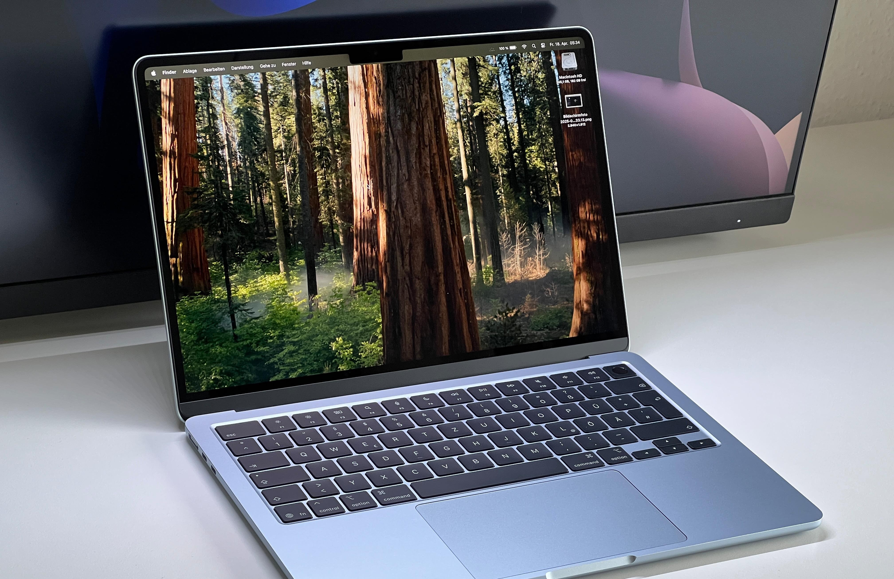
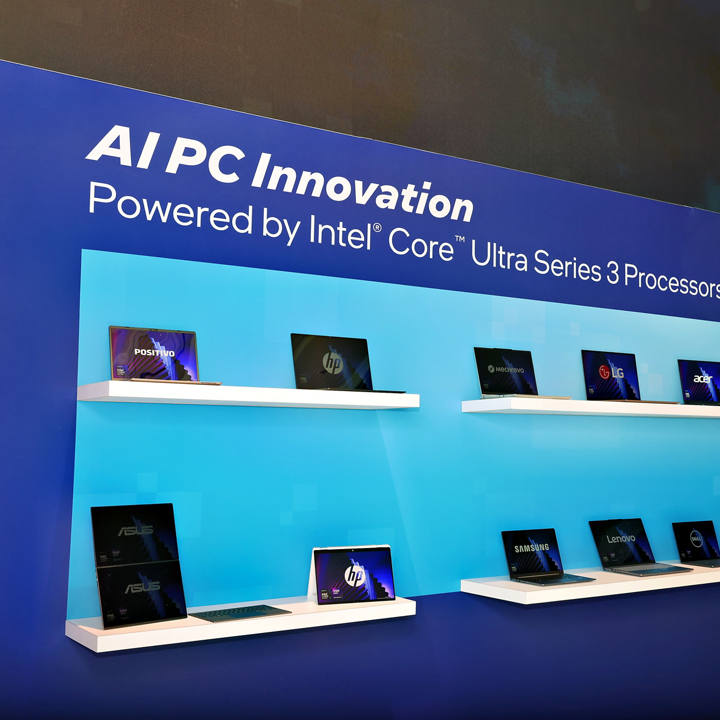
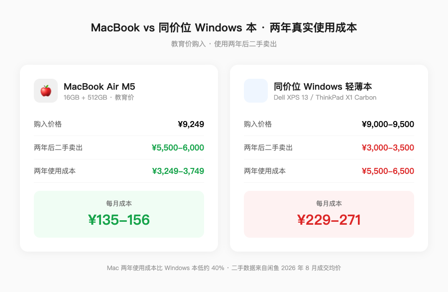
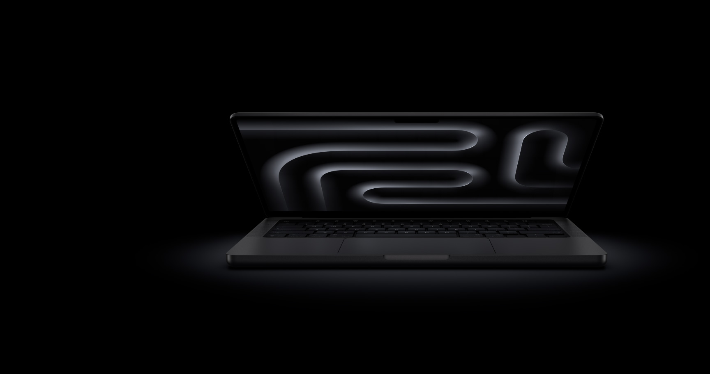
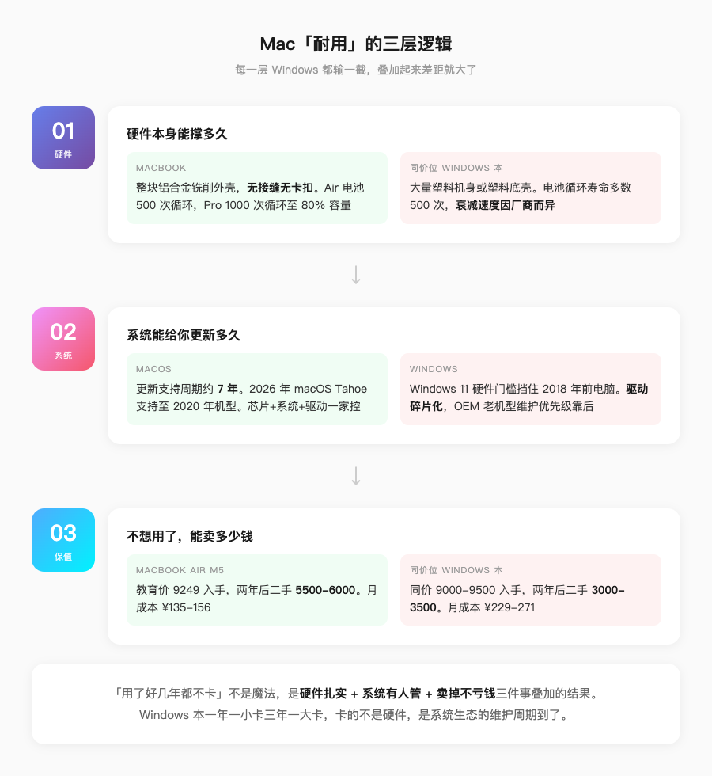

是真的。但原因可能跟你想的不一样。

大多数人觉得 Mac 耐用，是因为「用了好几年都不卡」。这个感受没错，但归因错了——不是苹果用了什么神秘材料，而是**耐用在 Mac 身上是三个独立维度叠加的结果**，每个维度 Windows 本都输了一截，加起来差距就大了。

_图源：Notebookcheck 评测实拍_

拆开看。

---

## 第一层：硬件本身能撑多久

MacBook 的外壳是一整块铝合金铣出来的。这个工艺苹果从 2008 年用到现在，十七年了。好处不是好看，是**没有接缝、没有卡扣、没有容易松动的地方**。你摔一下，塑料本可能裂一条缝，铝合金本最多凹一块。

Windows 阵营不是没有金属本，ThinkPad X1 Carbon、Dell XPS 13 都是镁合金或碳纤维，轻且结实。但同价位（8000-10000 元）的 Windows 本，大量还是塑料机身或塑料底壳。这个价位的用料差距是客观存在的。

_图源：Intel 官方 · CES 2026_

电池方面，苹果官方数据：MacBook Air 电池设计寿命 500 次完整充放电循环后保留 80% 容量，MacBook Pro 是 1000 次。按每天一充算，Air 大概用一年半到两年开始明显衰减，Pro 能用三年往上。

Windows 本的电池循环寿命官方数据参差不齐，多数厂商标 500 次，但实际衰减速度跟电池管理策略关系很大——有些厂商为了标称续航好看，充电策略激进，电池健康度掉得更快。

**硬件层面，同价位 Mac 的用料确实更扎实。但这不是决定性因素。** 一台电脑用三年就扔的话，铝合金和塑料的差距你感知不强。真正拉开差距的是后面两层。

---

## 第二层：系统能给你更新多久

这是最被低估的一点。

macOS 的更新支持周期大概是 7 年。2026 年的 macOS Tahoe 支持到 2020 年发布的 Mac。也就是说，你 2020 年买的 MacBook Air M1，到现在还能拿到最新的系统更新、安全补丁和新功能。

Windows 这边呢？Windows 11 的硬件门槛把 2018 年以前的电脑全挡在门外了——不是微软不想支持，是驱动碎片化太严重，OEM 厂商早就不给老机型维护驱动了。你一台 2019 年的 Windows 本，硬件没坏，但系统停更了，安全漏洞没人修，新软件慢慢不兼容，这时候你就觉得它「卡」了。

**其实不是卡，是没人管了。**

macOS 不存在这个问题。苹果自己造芯片、自己写系统、自己控驱动，更新决策链条只有一家公司。Windows 要协调微软 + Intel/AMD + NVIDIA + 几十个 OEM 厂商，老机型的驱动维护优先级天然靠后。

这个差距在你用的前两年感知不强，第三年开始明显，第五年就是鸿沟。

---

## 第三层：不想用了，能卖多少钱

这一层最直接，也最残酷。

一台 MacBook Air M5 教育价 9249 元入手，用两年卖掉，二手市场大概还能卖 5500-6000。两年使用成本 3000 出头。

同价位的 Windows 轻薄本，两年后二手大概 3000-3500。使用成本 5000-6000。

_图源：自制 · Mac 二手数据来自闲鱼 2026 年 8 月 MacBook Air M5 16+512 成交均价，Windows 数据来自同价位 Dell XPS 13 / ThinkPad X1 Carbon 二手成交均价_

**MacBook 不是贵，是贵得有理。** 你多花的钱，在卖掉的时候能拿回来一部分。Windows 本多花的钱，基本就是沉没成本。

这个保值率的底层逻辑还是前两层——买家愿意为「还能再战三年」付溢价，不愿意为「不知道什么时候停更」付溢价。

---

## 那 Windows 本就不耐用吗

也不是。

如果你问的是「硬件能不能用五年」，答案是可以。ThinkPad 的键盘手感、Dell 的售后、华为的生态协同，都有各自的优势。Windows 本在**同价位给到的绝对性能**通常比 Mac 高——同样 8000 块，Windows 本可能给到 i7 + 32GB + 1TB，Mac 只能给到 M5 + 16GB + 512GB。

_图源：苹果官网_

但「耐用」这个词，不只是硬件不坏。**系统有人管、卖掉不亏钱，这两件事加起来，才是「用好几年都不卡」的完整答案。**

Windows 本一年一小卡三年一大卡，卡的不是硬件，是系统生态的维护周期到了。

_图源：自制_

---

## 所以该怎么选

如果你的使用习惯是**一台电脑用 4-5 年**，Mac 的综合持有成本确实更低。多花的钱在保值率里能拿回来，系统更新让你不用中途换机。

如果你的使用习惯是**2-3 年就换**，或者你需要**同价位最强的绝对性能**（跑仿真、打游戏、本地训练模型），Windows 本的性价比更高。

没有谁碾压谁，只有谁更适合你的使用节奏。

_信源：苹果官网 MacBook Air/Pro 技术规格页（电池循环次数）、macOS Tahoe 兼容机型列表（支持至 2020 年机型）、闲鱼 2026 年 8 月 MacBook Air M5 及同价位 Windows 本二手成交数据。_

---

更多关于 MacBook 选购和价格实算，可以看我的这篇：[2026 苹果返校季教育优惠全攻略：官网 vs 京东国补逐台实算](https://zhuanlan.zhihu.com/p/156150196)

【延迟插卡：本题为知识科普类，非强购买意图，首发不带卡。发布 48h 后若排名进前 5 或赞数 ≥ 2，编辑插入 MacBook Air/Pro 好物卡】
