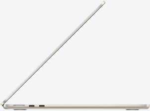
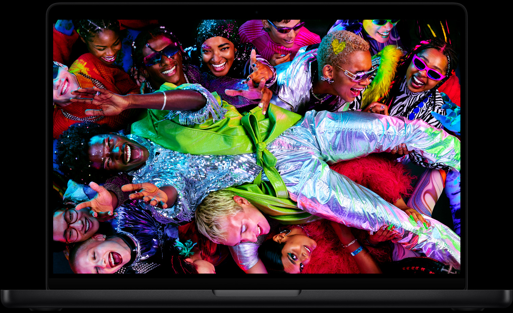

这个问题下面 49 个回答，我猜大部分在跟你说「买」或者「不买」。

我不这么干。我帮你做一个判断框架，你自己填答案。

---

## 先问自己一个问题：你现在的电脑，哪里让你不爽？

别急着回答「想体验苹果生态」。生态不是买一台电脑的理由，生态是你买了之后每天都在用的东西之间的协同。如果你现在只有 Windows，你根本没有生态可以「体验」——你有的只是一台新电脑。

真正该问的是：**你现在的电脑，哪个场景让你难受？**

列几个常见的：

**「带出去太重了。」** 拯救者、暗影精灵这类游戏本，2.5 公斤往上，加个充电器 3 公斤。每天背着通勤，肩膀会教你做人。MacBook Air 1.23 公斤，充电器就一个手机充电头大小。如果你每天带电脑出门，这个差距是体感级的。

**「风扇吵得没法用。」** 图书馆、教室、会议室，Windows 本一跑重任务风扇就起飞。MacBook Air 无风扇设计，永远安静。如果你需要在安静环境用电脑，这个优势没有替代品。

**「电池撑不了一上午。」** 大多数 Windows 本不插电干活，3-4 小时开始焦虑。MacBook Air [Notebookcheck 实测](https://www.notebookcheck-cn.com/Apple-MacBook-Air-13-M5.1244739.0.html) WiFi 续航 16 小时往上，早上满电出门，晚上回来还有电。如果你经常找不到插座，这个差距是生存级的。

**「用两年就卡了。」** Windows 本用久了系统变慢、注册表膨胀、驱动冲突，这是常态。macOS 的 Unix 底子和苹果对硬件软件的垂直整合，让 Mac 用 4-5 年性能衰减远小于同价位 Windows 本。如果你打算一台机器用很久，这个差距是长期复利。

如果你的不爽在上述四条里中了至少两条，MacBook 值得买。如果一条都没中，你现在的电脑用得好好的，那别买。

---

## 再问自己：你拿电脑干什么？

**写文档、看课件、做 PPT、查资料、看视频、轻度修图、写代码。**

这些任务 MacBook 全都能干，而且干得比同价位 Windows 本好。M 系列芯片的性能对这些场景过剩到离谱，你根本用不满。

**剪 4K 视频、跑本地大模型、编译大型项目、3D 渲染、CAD。**

这些任务需要 MacBook Pro，而且需要高配。Air 没有风扇，持续高负载会降频，你等不起。Pro 的散热和内存上限才是决定因素。

**打游戏。**

别买。macOS 的游戏生态跟 Windows 差了十年。Steam 上能玩的游戏，macOS 大概只有 30%。而且苹果芯片的 GPU 性能跟同价位 Windows 本的独立显卡比，差距明显。你是游戏玩家，老老实实用 Windows。

**跑专业软件（SolidWorks、ANSYS、某些行业专用软件）。**

先查清楚这些软件有没有 macOS 版本。很多工科软件只有 Windows 版，买了 Mac 发现装不上，那就尴尬了。

---

## 然后算一笔账

**MacBook 贵吗？** 看跟谁比。

跟同价位的 Windows 本比，MacBook 的屏幕、触控板、扬声器、续航、做工，每一项都领先。但 Windows 本有独立显卡、有升级空间、有游戏生态，这些 Mac 给不了。

**跟 iPhone 比呢？** 一台 iPhone 16 Pro 官网 8999 起，MacBook Air M5 教育价 9249。很多人花 9000 买手机不心疼，花 9000 买电脑犹豫半天。但电脑是你每天用 8 小时的生产力工具，手机是你每天看 2 小时的娱乐工具。哪个更值得投资，你自己想。

**跟「不买」比呢？** 如果你现在的电脑还能用，再撑一年，明年可能等到更好的芯片、更低的价格。但如果你现在的电脑已经让你难受了，早买早享受，晚买不一定有折扣——苹果的定价策略你懂的。

_图源：苹果官网_

---

## 最后给三个具体建议

**预算 5000 以内，就想试试 macOS。** MacBook Neo，教育价 4799 起。铝合金机身、A18 Pro 芯片、静音无风扇。短板是 8GB 内存和无键盘背光，但作为入门体验机，够用。[Notebookcheck 评测](https://www.notebookcheck-cn.com/Apple-MacBook-Neo-599.1250334.0.html)说它日常任务飞快，WiFi 续航接近 13 小时。

**预算 8000-10000，想要一台正经主力机。** MacBook Air 13 M5，16GB+512GB，教育价 9249，京东叠国补到手 7861。这是苹果产品线里性价比最高的机器，覆盖 90% 的使用场景。如果预算能到 9500，加 1500 上 24GB 内存，用四年不卡。

**预算 12000+，专业需求明确。** MacBook Pro 14 M4 或 M5。XDR 屏幕、主动散热、SD 卡槽、HDMI、三个雷雳口。设计、摄影、影视、计算机（AI/ML）方向的刚需。

_图源：苹果官网_

---

## 一句话

**MacBook 不是「该不该买」的问题，是「你拿它干什么」的问题。**

想清楚了再买，没想清楚别买。苹果的机器不便宜，但用对了地方，每一分钱都值。

_信源：苹果官网 MacBook 全系规格页及教育商店定价、京东自营国补实时价格（2026-08/09 采集）、Notebookcheck MacBook Neo/Air 13 M5 评测数据。_

---

更多关于 MacBook 选购和价格实算，可以看我的这篇：[2026 苹果返校季教育优惠全攻略：官网 vs 京东国补逐台实算](https://zhuanlan.zhihu.com/p/156150196)

【延迟插卡：本题为强购买意图决策题，但首发不带卡。发布 48h 后若排名进前 5 或赞数 ≥ 2，编辑插入——商品 1：MacBook Neo 教育价版（京东自营，链接待补齐），位置建议：「预算 5000 以内」段之后；商品 2：MacBook Air 13 M5 16+512（京东自营教育优惠版），位置建议：「预算 8000-10000」段之后】
